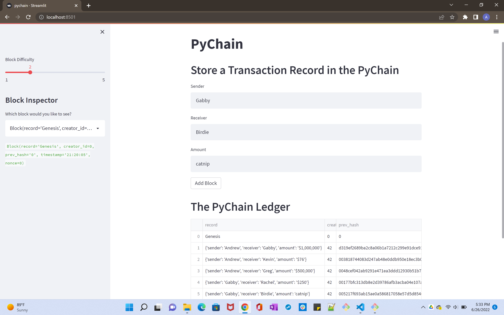
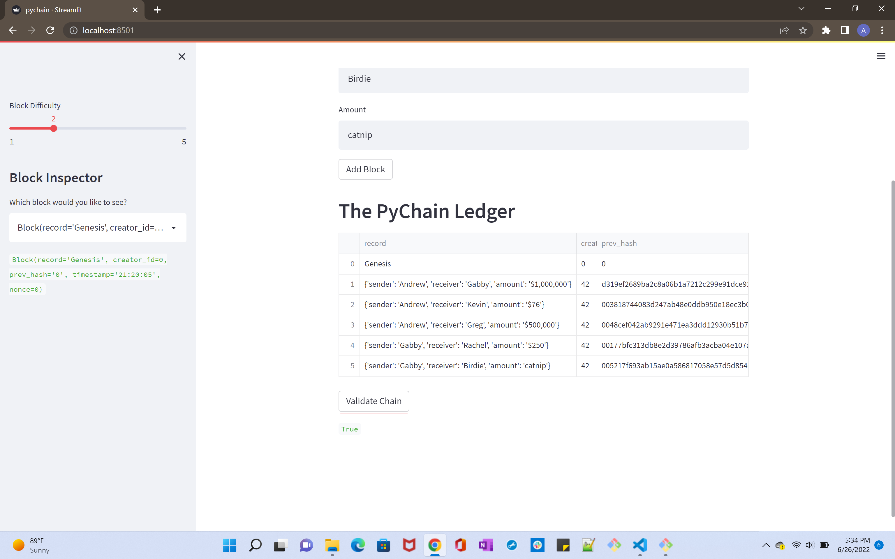

# Streamlit-Pychain-Ledger

Run your Streamlit application and store some mined blocks in your PyChain ledger. Then test the blockchain validation process by using your PyChain ledger. To do so, complete the following steps:

1. In the terminal, navigate to the project folder and run the Streamlit application by using streamlit run pychain.py.

2. Enter values for the sender, receiver, and amount, and then click the Add Block button. Do this several times to store several blocks in the ledger.

It should look something like this:

* You can verify the block contents and hashes in the Streamlit dropdown menu.

3. Test the blockchain validation process by using the web interface.

If the blockchain is valid, you should get a response like the one shown below:

